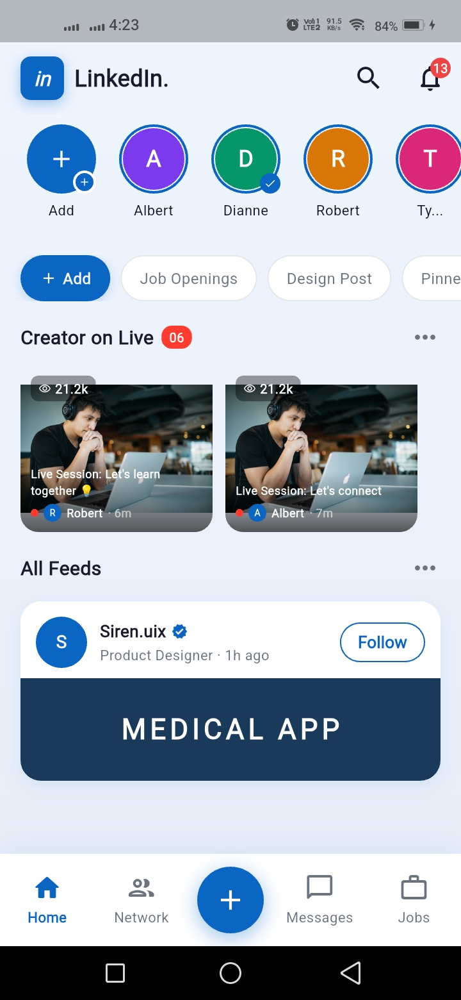
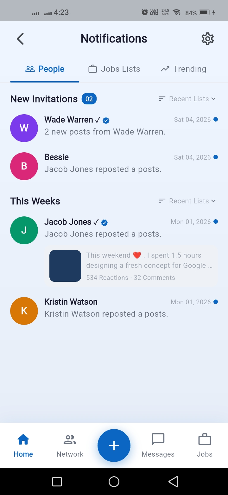

# LinkedIn Revamp

<p align="center">
  
  &nbsp;&nbsp;&nbsp;&nbsp;
  
</p>

---

> A pixel-perfect LinkedIn UI concept built in Flutter, focused on one thing: **stop the mindless scroll.**

---

## The Problem

Most people open LinkedIn with a purpose — find a job, learn something, connect with someone.  
But the feed pulls you in and 20–30 minutes disappear.

This project reimagines the LinkedIn UI around **getting you out faster**, not keeping you in.

---

## What's Different in This UI

- 🔴 **Live Sessions upfront** — see who is live, join or skip in one second
- 🏷️ **Filter Chips** — Job Openings, Design Posts, Pinned — you control your feed
- 🔔 **Notifications sorted** — People, Jobs, Trending — no more mixed noise
- ⚡ **Stories row** — quick scan without falling into a scroll hole

---

## Tech Stack

| Technology | Purpose |
|---|---|
| Flutter | UI framework |
| Riverpod | State management |
| MVVM | Architecture pattern |

---

## Project Structure

```
lib/
├── main.dart
├── app/
│   └── app.dart
│
├── core/
│   ├── constants/
│   │   ├── app_colors.dart         ← All hex colors from the mockup
│   │   ├── app_text_styles.dart    ← Every TextStyle used in the UI
│   │   └── app_strings.dart        ← All hardcoded strings (l18n-ready)
│   └── theme/
│       └── app_theme.dart          ← MaterialApp ThemeData config
│
├── models/                         ← Pure data classes (no logic)
│   ├── story_model.dart
│   ├── live_session_model.dart
│   ├── feed_model.dart
│   └── notification_model.dart
│
├── viewmodels/                     ← Business logic (MVVM "VM" layer)
│   ├── home_viewmodel.dart
│   └── notifications_viewmodel.dart
│
├── providers/                      ← Riverpod Provider declarations
│   ├── home_provider.dart
│   └── notifications_provider.dart
│
├── shared/
│   └── widgets/
│       └── bottom_nav_bar.dart     ← Shared across both screens
│
└── views/
    ├── home/
    │   ├── home_screen.dart        ← Main Home screen (Consumer widget)
    │   └── widgets/
    │       ├── story_circle_widget.dart
    │       ├── filter_chips_widget.dart
    │       ├── live_session_card.dart
    │       └── feed_card_widget.dart
    └── notifications/
        ├── notifications_screen.dart
        └── widgets/
            └── notification_item_widget.dart
```


## Getting Started

**1. Clone the repo**
```bash
git clone https://github.com/usman-flutter-dev/linkedin_revamp 
cd linkedin-revamp
```

**2. Install dependencies**
```bash
flutter pub get
```

**3. Run the app**
```bash
flutter run
```

---

## Add Screenshots

Create a `screenshots/` folder in the root of the project and add your images:
```
screenshots/
├── 01.jpeg
└── 02.jpeg
```

---

## Contributing

Pull requests are welcome.  
If you have ideas to improve the UI or add new screens, feel free to open an issue first.

---

## Credits

Special thanks to **Ishaq Hassan** for the guidance and mentorship throughout this project. 🤝

---

## License

This project is open source and available under the [MIT License](LICENSE).

## Getting Started

This project is a starting point for a Flutter application.

A few resources to get you started if this is your first Flutter project:

- [Lab: Write your first Flutter app](https://docs.flutter.dev/get-started/codelab)
- [Cookbook: Useful Flutter samples](https://docs.flutter.dev/cookbook)

For help getting started with Flutter development, view the
[online documentation](https://docs.flutter.dev/), which offers tutorials,
samples, guidance on mobile development, and a full API reference.
